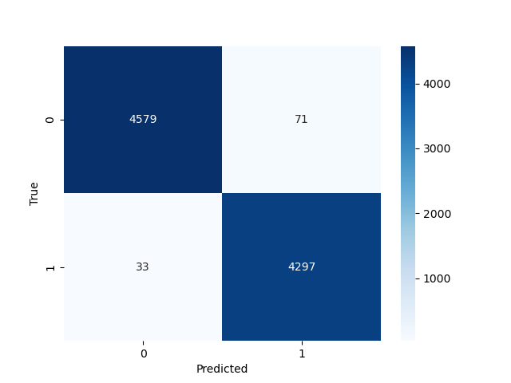

# Fake News Detection — Text Classification Project

## Project Overview
This project demonstrates a **text classification pipeline** to detect fake news.  
The goal is to automatically classify news articles as **real** or **fake** using classical NLP techniques:  
- Text preprocessing  
- Feature extraction using **TF-IDF/Count/Hashing**  
- **Logistic Regression/Linear SVC/Naive Bayes** model training  
- Model evaluation using metrics and confusion matrix  

---

## Dataset
- **Dataset:** [Fake and Real News Dataset (Kaggle)](https://www.kaggle.com/datasets/clmentbisaillon/fake-and-real-news-dataset)  
- **Files:** `True.csv` (real news), `Fake.csv` (fake news)  
- **Goal:** Classify news articles as **real (1)** or **fake (0)**  

---

## Kaggle API Setup Instructions
To allow the script to download the dataset automatically, you need a **Kaggle API key**:

1. **Create a Kaggle account** if you don’t have one: [https://www.kaggle.com/](https://www.kaggle.com/)  
2. **Generate API token**:  
   - Go to your profile → **Account** → **API** → **Create New API Token**  
   - This downloads a `kaggle.json` file  
3. **Place `kaggle.json` in the correct location**:
   - Linux/macOS: `~/.kaggle/kaggle.json`  
   - Windows: `C:\Users\<YourUser>\.kaggle\kaggle.json`  
4. **Set permissions (Linux/macOS)**:
   ```bash
   chmod 600 ~/.kaggle/kaggle.json

---

## Example Output

After running the `FND` class (`python FND.py`) against TF-IDF vectorizer and Logistic Regression classifier, the model produces evaluation metrics.

**Classification Report:**

| Class       | Precision | Recall | F1-Score | Support |
|------------|-----------|--------|----------|--------|
| Fake       | 0.99      | 0.98   | 0.99     | 4650   |
| Real       | 0.98      | 0.99   | 0.99     | 4330   |
| **Accuracy**  |       |    | 0.99     | 8980   |
| **Macro Avg** | 0.99      | 0.99   | 0.99     | 8980   |
| **Weighted Avg** | 0.99  | 0.99   | 0.99     | 8980   |

**Confusion Matrix Visualization:**



> The heatmap shows how many real/fake news articles were correctly classified vs misclassified.

---

## 📰 Fake News Detection – Classifier & Vectorizer Comparison

| Vectorizer | Classifier | Accuracy |
|-------------|------------------------|-----------|
| Count | Logistic Regression | **0.9957** |
| Count | Linear SVC | 0.9954 |
| TF-IDF | Linear SVC | 0.9944 |
| Hashing | Linear SVC | 0.9937 |
| TF-IDF | Logistic Regression | 0.9884 |
| Hashing | Logistic Regression | 0.9831 |
| Count | Naive Bayes | 0.9453 |
| Hashing | Naive Bayes | 0.9428 |
| TF-IDF | Naive Bayes | 0.9318 |

---

### 🔍 Summary

The **Fake News Detection** experiment demonstrates that **linear models (Logistic Regression and Linear SVC)** outperform Naive Bayes across all vectorization methods.  

- **Best overall performance:**  
  - `CountVectorizer + Logistic Regression` achieved the highest accuracy (**99.57%**), narrowly surpassing Linear SVC.  
- **Vectorizer insight:**  
  - Surprisingly, **CountVectorizer** slightly outperformed **TF-IDF** and **HashingVectorizer**, suggesting that simple frequency-based representations were sufficient for this dataset.  
- **Naive Bayes models** performed noticeably lower (~93–95%), indicating that the dataset benefits from models capable of capturing more complex linear boundaries.  

Overall, the results show that **Logistic Regression and Linear SVC are excellent baselines** for fake news classification, especially when paired with **CountVectorizer**.  

