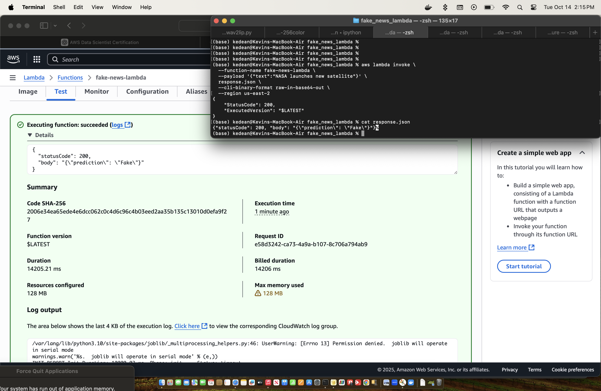

# Fake News Detection Lambda (Containerized)

This project demonstrates how to deploy a **machine learning model** as a containerized **AWS Lambda function** using **Docker** and **ECR**. The Lambda predicts whether a news article is **Fake** or **Real**.

---

## Table of Contents

- [Prerequisites](#prerequisites)
- [Step 1: Create ECR Repository](#step-1-create-ecr-repository)
- [Step 2: Build Docker Image](#step-2-build-docker-image)
- [Step 3: Push Docker Image to ECR](#step-3-push-docker-image-to-ecr)
- [Step 4: Create Lambda Function](#step-4-create-lambda-function)
- [Step 5: Test Lambda Function](#step-5-test-lambda-function)
- [Challenges & Solutions](#challenges--solutions)

---

## Prerequisites

- AWS account with ECR & Lambda permissions
- AWS CLI installed and configured (`aws configure`)
- Docker installed
- Python 3.x with `joblib` and `scikit-learn`

---

## Step 1: Create ECR Repository
```bash
aws ecr create-repository \
    --repository-name fake-news-lambda \
    --region us-east-2
```
- Note the repository URI for the next step.
- Example: `<account-id>.dkr.ecr.us-east-2.amazonaws.com/fake-news-lambda`

---

## Step 2: Build Docker Image
```bash
export DOCKER_BUILDKIT=0
docker build --platform linux/amd64 -t fake-news-lambda .
```
- Confirm it runs locally (port 8080 is optional for local testing):
```bash
docker run -p 9000:8080 fake-news-lambda
```
- test for prediction
```bash
curl -XPOST "http://localhost:9000/2015-03-31/functions/function/invocations" \
	-d '{"text":"Scientists discover water on Mars"}
```
- Sample output: `{"statusCode": 200, "body": "{\"prediction\": \"Fake\"}"}`

---

## Step 3: Push Docker Image to ECR
1. Authenticate Docker to ECR
```bash
aws ecr get-login-password --region us-east-2 | docker login --username AWS --password-stdin <account-id>.dkr.ecr.us-east-2.amazonaws.com
```
2. Tag the image:
```bash
docker tag fake-news-lambda:latest <account-id>.dkr.ecr.us-east-2.amazonaws.com/fake-news-lambda:latest
```
3. Push to ECR:
```bash
docker push <account-id>.dkr.ecr.us-east-2.amazonaws.com/fake-news-lambda:latest
```

---

## Step 4: Create Lambda Function
```bash
aws lambda create-function \
    --function-name fake-news-lambda \
    --package-type Image \
    --code ImageUri=<account-id>.dkr.ecr.us-east-2.amazonaws.com/fake-news-lambda:latest \
    --role arn:aws:iam::<account-id>:role/fakenews-lambda-execution-role \
    --timeout 60 \
    --region us-east-2
```
- Important: Increase `--timeout` from default 3 seconds to 60 seconds to allow model inference to complete.
- Replace `<account-id>` with your AWS account number.

---

## Step 5: Test Lambda Function
CLI Test
```bash
aws lambda invoke \
    --function-name fake-news-lambda \
    --region us-east-2 \
    --payload '{"text": "SpaceX launches new rocket into orbit"}' \
    response.json

cat response.json
```


> Showing that it can be run from the AWS console or the terminal

CloudWatch Logs
- Navigate to **CloudWatch → Logs → /aws/lambda/fake-news-lambda** to see invocation logs.

---

## Challenges & Solutions

| Issue | Cause | Solution |
|-------|-------|---------|
| PERMISSION_DENIED during ECR push | Wrong AWS account or missing permissions | `aws configure` and ensure correct IAM user/role |
| Timeout errors on Lambda | Default Lambda timeout is 3 seconds | Increase timeout to 60 seconds (`--timeout 60`) |
| Architecture mismatch on Mac M1/M2 | Default build is arm64 | Use `--platform linux/amd64` when building Docker image |
| ModuleNotFoundError (joblib, sklearn) | Missing dependencies | Include all packages in `requirements.txt` |
| Docker port conflict on local run | Port 8080 already used | Stop conflicting service or change `-p` mapping |

---

## Notes

- This Lambda uses a **pickled scikit-learn** model and vectorizer. Ensure both `best_model.pkl` and `best_vectorizer.pkl` are included in the container.
- Lambda is invoked via a **POST request** with JSON payload:
```bash
{"text": "<text to classify>"}
```
- Response is JSON:
```bash
{"prediction":"Fake"}  // or "Real"
```
