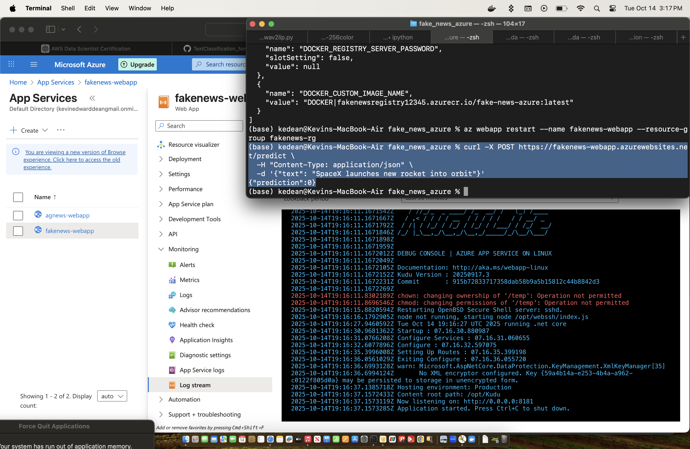

# Fake News Detection - Azure Deployment

This project demonstrates how to deploy a **Fake News Detection model** (trained on the Kaggle dataset) as a Flask web service in **Azure App Service using Docker**. The deployment includes handling model and vectorizer serialization, Docker containerization, and Azure Container Registry (ACR) integration.

---

## Table of Contents

- [Project Overview](#project-overview)  
- [Prerequisites](#prerequisites)  
- [Docker Containerization](#docker-containerization)  
- [Azure Deployment](#azure-deployment)  
- [Testing](#testing)  
- [Challenges & Solutions](#challenges--solutions)

---

## Project Overview

This project includes:

- A Flask app exposing a `/predict` endpoint for fake news classification.
- Serialized model (`best_model.pkl`) and vectorizer (`best_vectorizer.pkl`) files.
- Dockerfile for containerizing the Flask app.
- Deployment to Azure App Service via Azure Container Registry.

---

## Prerequisites

- Python 3.10+  
- Docker (with BuildKit enabled)  
- Azure CLI  
- Azure subscription (free tier is sufficient)  

---

## Docker Containerization

1. **Create Dockerfile**

2. **Build the Docker image (without cache to avoid architecture or stale dependency issues):**
- **IMPORTANT - Make sure you wait to peform the docker build until after step 2 in Azure Deployment Section has been performed!**
```bash
export DOCKER_BUILDKIT=1
docker buildx build --platform linux/amd64 --no-cache -t fakenewsregistry12345.azurecr.io/fake-news-azure:latest .
```

3. **Run locally to test:**
```bash
docker run -p 8080:8080 fake-news-azure
curl -X POST http://127.0.0.1:8080/predict -H "Content-Type: application/json" -d '{"text": "SpaceX launches new rocket"}'
```

---

## Azure Deployment

1. **Create Resource Group & App Service Plan**
```bash
az group create --name fakenews-rg --location "centralus"

az appservice plan create \
  --name fakenews-plan \
  --resource-group fakenews-rg \
  --sku B1 \
  --is-linux \
  --location "centralus"
```

2. **Create Azure Container Registry (ACR)**
```bash
az acr create --resource-group fakenews-rg --name fakenewsregistry12345 --sku Basic
az acr update -n fakenewsregistry12345 --admin-enabled true
```

3. **Push Docker Image to ACR**
```bash
az acr login --name fakenewsregistry12345
docker push fakenewsregistry12345.azurecr.io/fake-news-azure:latest
```

4. **Create Web App & Configure Container**
```bash
az webapp create --resource-group fakenews-rg --plan fakenews-plan --name fakenews-webapp --deployment-container-image-name fakenewsregistry12345.azurecr.io/fake-news-azure:latest

az webapp config container set \
  --name fakenews-webapp \
  --resource-group fakenews-rg \
  --container-registry-url fakenewsregistry12345.azurecr.io \
  --container-registry-user "$(az acr credential show -n fakenewsregistry12345 --query username -o tsv)" \
  --container-registry-password "$(az acr credential show -n fakenewsregistry12345 --query "passwords[0].value" -o tsv)" \
  --container-image-name fakenewsregistry12345.azurecr.io/fake-news-azure:latest

az webapp restart --name fakenews-webapp --resource-group fakenews-rg
```

---

## Testing Deployment

Test the live endpoint:
```bash
curl -X POST https://fakenews-webapp.azurewebsites.net/predict \
  -H "Content-Type: application/json" \
  -d '{"text": "SpaceX launches new rocket into orbit"}'
```

Example Response:
```json
{
  "prediction": 0
}
```



---

## Challenges & Solutions:

1. No challenges this time, after following the README.md created in
   Github repository: TextClassification_NewsTopicClassifier/cloud/Azure
