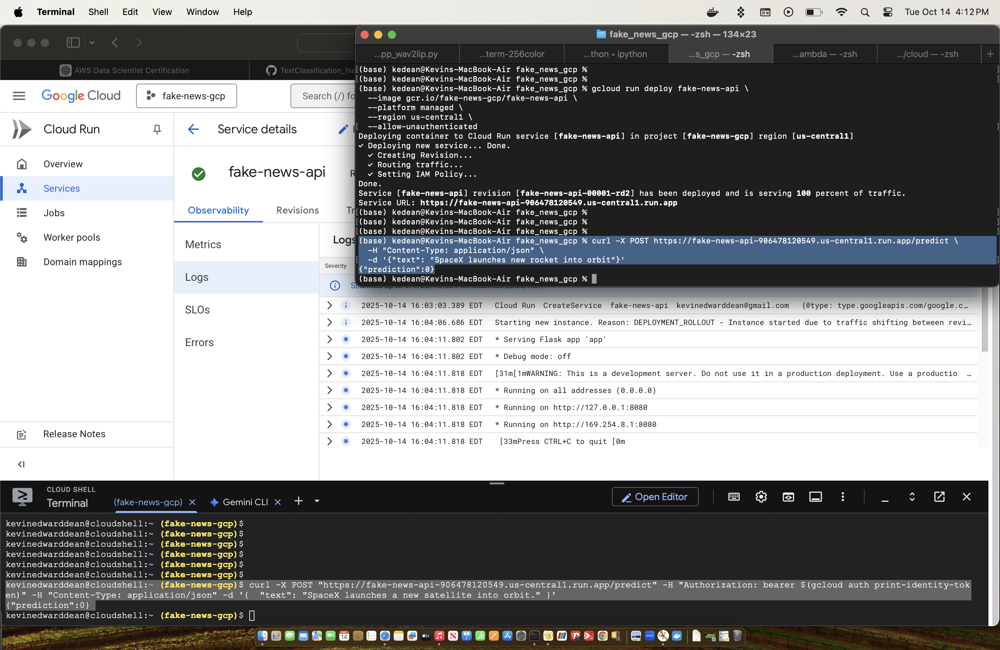

# 🧠 Fake News Text Classification API (GCP Deployment)

This project demonstrates how to deploy a **Flask-based text classification API** trained on the `Kaggle: Fake News` dataset to **Google Cloud Platform (GCP)** using **Cloud Run** and **Container Registry**.

The model and vectorizer were pre-trained locally using scikit-learn, serialized with `joblib`, and then containerized into a production-ready API.

---

## 🚀 Overview

- **Model**: Logistic Regression (trained on AG News)
- **Vectorizer**: Count
- **Framework**: Flask  
- **Deployment Platform**: Google Cloud Run  
- **Container Registry**: Google Container Registry (GCR)  
- **Architecture**: `linux/amd64` (to match GCP build environment)  
- **Language**: Python 3.10  

---

## 🛠️ Step-by-Step Setup

### 1. Install and Initialize Google Cloud SDK

```bash
# Install gcloud on macOS
brew install --cask google-cloud-sdk

# Initialize gcloud
gcloud init
```

Follow the on-screen prompts to:
	- Log in with your Google account
	- Choose or create a project (we used fake-news-gcp)
	- Set a default region (e.g., us-central1)

---

### 2. Enable Required GCP APIs
```bash
gcloud services enable run.googleapis.com containerregistry.googleapis.com
```

Problem Encountered:
```bash
ERROR: Billing account for project '############' is not found.
```

Solution:
- GCP requires billing to be linked even for free-tier usage.
- Go to **Billing → Link a billing account** in the Google Cloud Console, then rerun the command.

---

### 3. Prepare Your Flask App: app.py

---

### 4. Create the requirements.txt

---

### 5. Create the Dockerfile

---

### 6. Build and Push the Docker Image
```bash
# Build the Docker image with GCP-compatible architecture
docker buildx build --platform linux/amd64 -t gcr.io/fake-news-gcp/fake-news-api .

# Submit the build to GCP Container Registry
gcloud builds submit --tag gcr.io/fake-news-gcp/fake-news-api
```

Problem Encountered:
```bash
PERMISSION_DENIED: The caller does not have permission.
```

Solution:
Ensure your terminal is authenticated as the correct Google account:
```bash
gcloud auth login
gcloud config set project fake-news-gcp
gcloud projects add-iam-policy-binding fake-news-gcp \                         
  --member="user:<your-email-here>@gmail.com" \
  --role="roles/editor"
```

---

### 7. Deploy to Cloud Run
```bash
gcloud run deploy fake-news-api \
  --image gcr.io/fake-news-gcp/fake-news-api \
  --platform managed \
  --region us-central1 \
  --allow-unauthenticated
```

---

### 8. Test the Live API
After successful deployment, GCP will output a public URL, for example:
```bash
https://fake-news-api-abcdef123-uc.a.run.app
```

Run a test from your terminal:
```bash
curl -X POST https://fake-news-api-abcdef123-uc.a.run.app/predict \
  -H "Content-Type: application/json" \
  -d '{"text": "SpaceX launches new rocket into orbit"}'
```


> Showing that the container can run the prediction from the GCP web console and terminal.

✅ Example Output:
```bash
{"prediction": 0}
```

---

## 🧰 Common Issues & Fixes

| Issue | Cause | Solution |
|-------|--------|-----------|
| `PERMISSION_DENIED` during `gcloud builds submit` | Incorrect account | Run `gcloud auth login` and set project |

---

## Summary

This deployment shows how to:
- Train a text classification model
- Serialize and serve it with Flask
- Containerize it for portability
- Deploy it to Google Cloud Run
- Test it live via public API

---

## Notes

- Cloud Run scales automatically based on incoming requests.
- You can add logging via print() or logging to see messages in Cloud Run Logs.
- This approach also works on AWS (Elastic Beanstalk, Lambda) and Azure (Web Apps).
